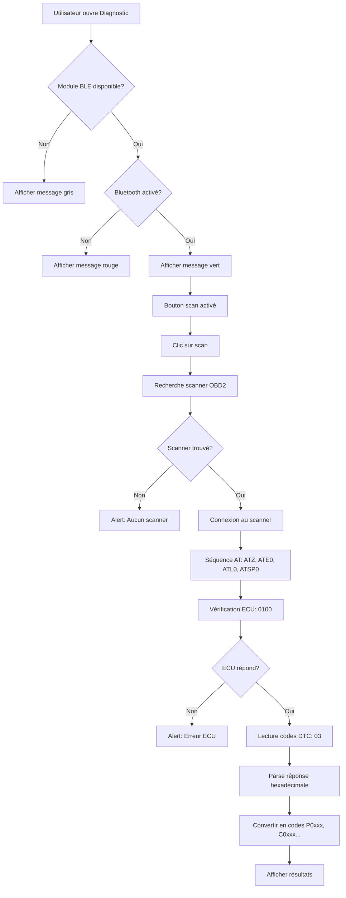

# 🎯 Résumé de la Migration OBD2 - Page Diagnostic

## ✅ Travail Effectué

### 1. Migration Complète vers `app/diagnostic.tsx`

Toute la fonctionnalité OBD2 a été migrée depuis `app/documents/scanInspectionMecanique.tsx` vers la page dédiée **OBD2 Diagnostic** accessible depuis l'accueil.

### 2. Fichiers Modifiés

#### `app/diagnostic.tsx` (réécriture complète)
**Ajouts :**
- ✅ Imports OBD2Manager, OBD2InterpretationService, State (ble-plx)
- ✅ 6 nouveaux états React pour gérer le scan OBD2
- ✅ Fonction `checkBluetoothState()` avec détection de disponibilité
- ✅ Fonction `scanOBD2Device()` complète (recherche, connexion, séquence AT, lecture DTC)
- ✅ Interface indicateur Bluetooth avec 3 états (activé/désactivé/non-supporté)
- ✅ Affichage des résultats avec codes DTC, sévérité, descriptions
- ✅ Section debug avec réponse brute

**Supprimé :**
- ❌ Code de simulation (mockData, setTimeout)
- ❌ Interface de résultats factices

#### `services/OBD2Manager.ts` (amélioration)
**Ajouts :**
- ✅ `checkBleAvailability()` : détecte si module natif BLE disponible
- ✅ Gestion gracieuse du cas Expo Go (sans module natif)
- ✅ Retourne `State.Unsupported` si module non disponible
- ✅ Message d'avertissement clair dans console

**Modifications :**
- Import `NativeModules` de React Native
- Variable statique `bleAvailable` pour cache de détection
- `initialize()` vérifie disponibilité avant instanciation BleManager
- `checkBluetoothState()` retourne Unsupported si module manquant

### 3. Nouveau Document

#### `docs/BUILD_NATIF_REQUIS.md`
Guide complet expliquant :
- ❓ Pourquoi l'erreur se produit
- 🔧 Comment résoudre (3 options de build)
- 📱 Workflow de développement recommandé
- 🧪 Comment tester sur appareil physique

## 🎨 Interface Utilisateur

### Indicateur Bluetooth (3 états)

| État | Couleur | Icône | Message |
|------|---------|-------|---------|
| **Activé** | 🟢 Vert | `bluetooth` | "✓ Bluetooth activé" |
| **Désactivé** | 🔴 Rouge | `bluetooth-off` | "✗ Bluetooth désactivé - Activez-le dans les paramètres" |
| **Non supporté** | ⚪ Gris | `alert-circle` | "⚠️ Module BLE non disponible (utilisez un build natif)" |

### Bouton "Démarrer le diagnostic OBD2"
- **Activé** : si Bluetooth = activé (vert)
- **Désactivé** : si Bluetooth = désactivé (rouge) ou non-supporté (gris)

### Message d'information contextuel
- **Si BLE disponible** : Instructions pour connecter le scanner ELM327
- **Si BLE non disponible** : Instructions pour compiler un build natif

### Affichage des Résultats

```
📋 Résultats du diagnostic
├── Statut global (vert/orange/rouge)
│   ├── ✅ Aucun code d'erreur
│   ├── ⚠️ X code(s) détecté(s)
│   └── ❌ Codes critiques
│
└── Liste des codes DTC
    ├── Code (ex: P0420)
    ├── Badge sévérité (critique/majeur/mineur)
    ├── Description
    └── Explication

📝 Réponse brute (debug)
└── Texte brut du scanner
```

## 🔄 Flux d'Exécution



## 🚨 Gestion d'Erreurs

### Expo Go (module non disponible)
```
État: bluetoothEnabled = null
Indicateur: Gris avec icône alert-circle
Message: "Module BLE non disponible"
Bouton: Désactivé
Alert au clic: "Compilez avec npx expo run:android"
```

### Bluetooth désactivé
```
État: bluetoothEnabled = false
Indicateur: Rouge avec icône bluetooth-off
Message: "Bluetooth désactivé"
Bouton: Désactivé
Alert au clic: "Activez Bluetooth dans paramètres"
```

### Scanner non trouvé
```
Alert: "Aucun scanner trouvé"
Instructions:
- Scanner allumé?
- Bluetooth activé?
- Scanner à proximité?
```

### ECU ne répond pas
```
Alert: "Erreur ECU"
Instructions:
- Contact mis?
- Scanner branché au port OBD2?
- Véhicule compatible OBD2 (1996+)?
```

## 📋 État de l'Implémentation

### ✅ Phase 1 : Détection Bluetooth
- [x] Vérification état Bluetooth au montage
- [x] Indicateur visuel avec 3 états
- [x] Bouton refresh
- [x] Détection module natif disponible

### ✅ Phase 2 : Connexion Scanner
- [x] Scan devices BLE (filtre OBD/ELM327)
- [x] Connexion au premier scanner trouvé
- [x] Découverte services/caractéristiques
- [x] Abonnement notifications

### ✅ Phase 3 : Séquence AT
- [x] ATZ (reset)
- [x] ATE0 (désactiver écho)
- [x] ATL0 (supprimer sauts ligne)
- [x] ATSP0 (auto-protocole)
- [x] 0100 (vérification ECU)
- [x] 03 (lecture codes DTC)

### ✅ Phase 4 : Parsing & Affichage
- [x] Parse réponse hexadécimale
- [x] Conversion hex → code DTC (P0420, etc.)
- [x] Affichage codes bruts
- [x] Interface utilisateur complète
- [ ] Interprétation IA (Agent Blink - placeholder)

### ⏳ Phase 5 : Interprétation IA (Non implémentée)
- [x] Placeholder `interpretDTCWithAI()` préparé
- [x] Variable d'environnement `EXPO_PUBLIC_BLINK_AGENT_URL`
- [ ] Intégration Agent Blink (URL à fournir)
- [ ] Appel HTTP POST avec codes DTC
- [ ] Affichage interprétations riches

## 🧪 Test Requis

### Pour tester sur appareil réel :

1. **Compiler un build natif** :
   ```bash
   npx expo run:android
   # ou
   npx expo run:ios
   ```

2. **Matériel nécessaire** :
   - Smartphone Android/iOS physique
   - Scanner OBD2 Bluetooth ELM327
   - Véhicule compatible OBD2 (1996+)

3. **Procédure de test** :
   1. Brancher le scanner au port OBD2 du véhicule
   2. Mettre le contact (moteur peut être éteint)
   3. Activer Bluetooth sur le smartphone
   4. Ouvrir l'app → OBD2 Diagnostic
   5. Vérifier indicateur vert
   6. Cliquer "Démarrer le diagnostic"
   7. Attendre connexion et scan (20-30 secondes)
   8. Vérifier résultats affichés

## 📂 Structure des Fichiers

```
C:\Projets\Apptaxi\
├── app/
│   └── diagnostic.tsx ⭐ FICHIER PRINCIPAL MODIFIÉ
│
├── services/
│   ├── OBD2Manager.ts ⭐ AMÉLIORÉ (détection BLE)
│   └── OBD2InterpretationService.ts (inchangé)
│
└── docs/
    ├── BUILD_NATIF_REQUIS.md ⭐ NOUVEAU
    ├── SCANNER_OBD2.md (référence précédente)
    └── BLUETOOTH_STATUS_INDICATOR.md (référence précédente)
```

## 🔗 Accès à la Fonctionnalité

**Navigation :**
```
Page d'accueil → Bouton "OBD2 Diagnostic" → app/diagnostic.tsx
```

**Route :**
```
/diagnostic
```

## 📝 Notes Importantes

1. **Expo Go ne supporte PAS** la fonctionnalité BLE
   - Le code détecte automatiquement cette limitation
   - Affiche un message clair à l'utilisateur

2. **Build natif requis** pour utiliser le scanner
   - Compilez avec `npx expo run:android/ios`
   - Ou utilisez EAS Build pour un build cloud

3. **Test sur appareil physique seulement**
   - Les émulateurs/simulateurs n'ont pas de Bluetooth
   - Un vrai scanner ELM327 est nécessaire

4. **Interprétation IA non implémentée**
   - Pour le moment : affichage codes bruts uniquement
   - Placeholder prêt pour Agent Blink (Phase 5)

5. **L'ancienne implémentation** dans `scanInspectionMecanique.tsx` peut être supprimée si vous ne l'utilisez plus.

## ✨ Prochaines Étapes Suggérées

1. **Tester sur appareil réel** avec un build natif
2. **Configurer Agent Blink** (URL d'API)
3. **Implémenter interprétation IA** des codes DTC
4. **Ajouter historique** des scans OBD2
5. **Enregistrer résultats** dans Firebase pour suivi
6. **Nettoyer** l'ancienne implémentation dans scanInspectionMecanique.tsx

---

**✅ Migration terminée avec succès !**  
La fonctionnalité OBD2 est maintenant dans la page dédiée **OBD2 Diagnostic** et gère gracieusement le cas Expo Go.
